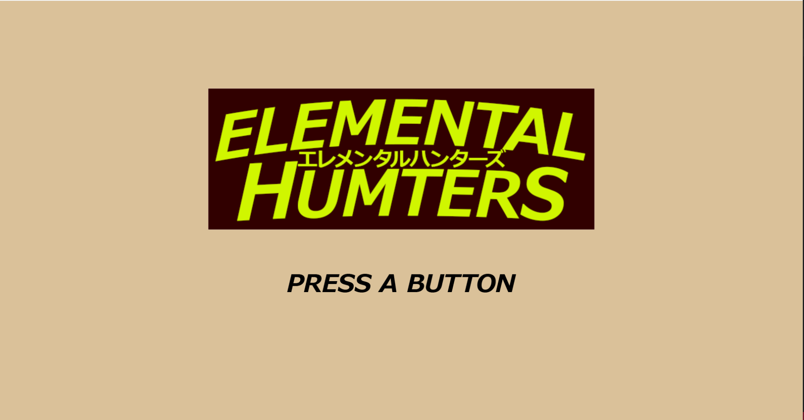
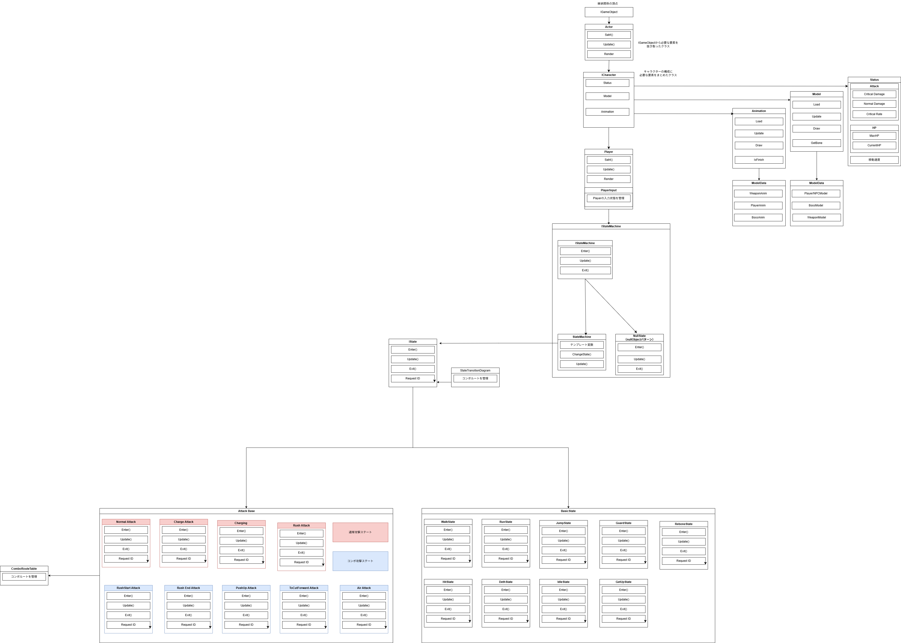

<link rel="stylesheet" href="style.css">

# ELEMENTAL HUNTERS  

## Image 01: タイトル画面

 

## 目次
- ## 1. [プロフィール](#1プロフィール)
- ## 2. [作品概要](#2作品概要)
- ## 3. [チーム構成と担当箇所](#3チーム構成と担当箇所)
  ## &emsp; 3-0.[開発チーム構成](#part3-0)
  ## &emsp; 3-1.[担当箇所](#part3-1)
- ## 4. [ゲームの特徴](#4-ゲームの特徴)
  ## &emsp; 4-1[ゲームの特徴](#part4-1)
  ## 5. [操作方法](#5-操作方法)
  ## &emsp; 5-1.[基本操作](#part5-1)
  ## &emsp; 5-2.[復活システム](#part5-2)
  ## &emsp; 5-3.[攻撃方法](#part5-3)
- ## 6.[技術的工夫点](#6技術的工夫点)
  ## &emsp; 6-1.[クラス設計の見直しについて](#part6-1)
  ## &emsp; 6-2.[階層型ステートパターンの導入](#part6-2)
  ## &emsp; 6-3.[担当箇所の全体設計図](#part6-3)
- ## 7. 今後の展望
- ## 9. リンク集  
****

## 1.プロフィール

- ## 氏名: 山口 隼(ヤマグチ ハヤト)
  
- ## 所属: 河原電子ビジネス専門学校 ゲームクリエイター科 27卒
  
- ## 希望職種: プログラマ
  
- ## Email: CA01244029@st.kawahara.ac.jp
****

## 2.作品概要

-  ## 使用言語: 
   ## &emsp; C++14  
   ## &emsp; DirectX

- ## 開発環境: 
   ## &emsp; VisualStudio 2022  
   ## &emsp; 学内エンジン

- ## 開発ツール: 
  ## &emsp; バージョン管理: GitHub / Forkクライアント
  ## &emsp; 連絡手段: Teams
****

## 3.チーム構成と担当箇所

- ## 3-0.開発チーム構成:
  - ## アウトゲーム全般担当:1人
    ## &emsp; UI/演出/ゲームフロー全体の管理

   

  - ## インゲーム担当2人 
    ## &emsp; Bossキャラクター/NPC担当
    ## &emsp; Playerキャラクター/ステージ制御担当

  ## 計3人構成
****

- ## 3-1.担当箇所：
  ## &emsp; ステージモデルの制作
  ## &emsp; ステージの読み込み・進行管理システムの構築
  ## &emsp; プレイヤーアクションの設計・実装（状態遷移、コンボルート等）
  ## &emsp; 武器の当たり判定とダメージ計算の実装
  ## &emsp; ダメージポップアップの演出・UI実装
****

- ## 4.ゲームの特徴
  - ## 4-1.ゲームの特徴
    ## ■ 特徴-1 共闘ができるアクションゲーム。
    ## &emsp; ユーザーとNPCが共闘する3Dアクションゲームです。
    ## &emsp; 勿論ソロプレイも可能となっています。
  
  - ## ■ 特徴-2 ボスの討伐のために繰り広げられるスピーディーなバトル
    ## &emsp; 制限時間以内にボスの討伐を行うことがゲームクリアの目的となっています。
    ## &emsp; また、攻撃を組み合わせることでコンボを発動することも可能となっており攻撃手段の幅を増やしています。
****

## 5.操作方法
  - ## 5-1.基本操作
    - ## 移動: Lスティック
    - ## ジャンプ: A
    - ## ダッシュ: LB + B
    - ## ガード: LT(背面)
    - ## 復活システム発動: Y    

  - ## 5-2.復活システム
    - ## 概要: 他キャラクターのHPが0になった際、近くでYボタンを押すことで数秒間かけて復活をさせることができます。
    <video src="./Video/ReboneSystem.mp4" controls width="100%"></video>

  - ## 5-3.攻撃方法
    - ## 種類とボタン配置
      - ## 通常攻撃: Bを単発で押す。
      <video src="./Video/NormalAttack.mp4" controls width="100%"></video>
 
      - ## チャージ攻撃: Bを長押し
      <video src="./Video/ChargeAttack.mp4" controls width="100%"></video>

      - ## 連続攻撃: Bを連打
      <video src="./Video/RushAttack.mp4" controls width="100%"></video>
 
      - ## 斬り進む攻撃: ダッシュ状態でB
      <video src="./Video/ToCutForward.mp4" controls width="100%"></video>

      - ## 空中攻撃: ジャンプ状態でB
      <video src="./Video/AirAttack.mp4" controls width="100%"></video>
****

## 6.技術的工夫点 
  - ## 6-1.設計の見直しについて
    ## ■ 課題
    ## &emsp; プレイヤーやNPCなど、キャラクターごとに同じような処理を書いてしまってはクラスが肥大化してしまい可読性/拡張性に欠けるためです。

    ## ■ 工夫点
    ## &emsp; キャラクターの土台となるICharacterクラスを作り、Playerはそこから機能を引き継ぐ形にしました。

    ## ■ 結果
    ## &emsp; 共通の仕組みを1箇所にまとめられたので、コードがスッキリして管理や修正がとても楽になりました。

  - ## 6-2.階層型ステートパターンの導入
    ## ■ 課題
    ## &emsp; アクションを作る際、コンボの派生条件をコーディングするのが困難であっためです。

    ## ■ どう工夫したか
    ## &emsp; 攻撃のベースとなるPlayerAttackBaseStateという親ステートを作り、各攻撃アクションはそれを引き継ぐ階層型にしました。
    ## &emsp; また、コンボのルートや状態遷移はComboRouteTableなどのテーブとして独立させ、ステート本体から切り離しています。

    ## ■ 結果
    ## &emsp; 新しいアクションの追加が簡単になり、コンボの繋がりも瞬時に実装できるようになりました。 

   - ## 6-3.全体のクラス設計と状態遷移の仕組み
     - ## クラス設計
     
## &emsp;        
****

## 7.今後の展望
- ## キャラの種類の追加
- ## ステージの追加
****

## 8. リンク集
- ## Youtube: [こちらからアクセスできます](https://www.youtube.com/@%E5%B1%B1%E5%8F%A3%E9%9A%BC-kawahara)
  
- ## Googleドライブ: [こちらからアクセスできます](https://drive.google.com/drive/folders/1uRL0AiCKYP2HvznbBXS_wLJY3bZnr4bU?usp=drive_link)

- ## GitHub: [こちらからアクセスできます](https://github.com/TanimotoYuuki/Project-EH)

- ## 過去作品(個人制作): [こちらからアクセスできます](https://github.com/YamaguchiHayato/Dimensional-Flip)

- ## 過去開発(チーム開発): [こちらからアクセスできます](https://github.com/TanimotoYuuki/EhimeGuri)
****