<link rel="stylesheet" href="style.css">

# ELEMENTAL HUNTERS  
## 最大4人で遊べる2D視点アクションゲーム

---

## 最初に見てほしいポイント

| 見てほしい内容 | 理由 |
|---|---|
| PV | ゲーム全体の流れ、キャラクター、ボス戦の雰囲気が短時間で分かるため |
| キャラクター紹介 | 武器ごとの役割やアクションの違いが分かるため |
| 操作方法・攻撃方法 | 入力によって攻撃が変化する本作の面白さが分かるため |
| 入力Adapter / NPC制御 | PlayerとNPCの処理を共通化した設計意図が分かるため |
| 発射リクエスト / Factory | 攻撃Stateと弾生成処理の責務分離が分かるため |

---

## 目次

### よく見てほしい項目

| 項目 | 内容 |
|---|---|
| [PV](#part0-1) | ゲーム全体の雰囲気を確認できます |
| [ゲームの特徴](#4ゲームの特徴) | どんなゲームか、何が面白いかを確認できます |
| [キャラクター紹介](#6キャラクター紹介) | 武器ごとの役割やアクション差を確認できます |
| [技術的工夫点](#7技術的工夫点) | 設計・実装面で工夫した箇所を確認できます |
| [リンク集](#9リンク集) | 動画・GitHub・提出物へ移動できます |

詳細目次を開く

- [ELEMENTAL HUNTERS](#elemental-hunters)
  - [最大4人で遊べる2D視点アクションゲーム](#最大4人で遊べる2d視点アクションゲーム)
  - [最初に見てほしいポイント](#最初に見てほしいポイント)
  - [目次](#目次)
    - [よく見てほしい項目](#よく見てほしい項目)
  - [0.README](#0readme)
    - [0-1.PV](#0-1pv)
    - [0-2.ゲーム紹介スライド](#0-2ゲーム紹介スライド)
    - [0-3.技術紹介スライド](#0-3技術紹介スライド)
  - [1.プロフィール](#1プロフィール)
    - [強み](#強み)
  - [2.作品概要](#2作品概要)
  - [3.チーム構成と担当箇所](#3チーム構成と担当箇所)
    - [3-0.開発チーム構成](#3-0開発チーム構成)
    - [3-1.担当箇所](#3-1担当箇所)
      - [プレイヤー・キャラクター実装](#プレイヤーキャラクター実装)
      - [アクション・状態管理](#アクション状態管理)
      - [NPC・入力処理](#npc入力処理)
      - [弾・魔法・生成処理](#弾魔法生成処理)
      - [モデル・アニメーション・演出管理](#モデルアニメーション演出管理)
      - [ステージ・背景](#ステージ背景)
  - [4.ゲームの特徴](#4ゲームの特徴)
    - [4-1.どんなゲームか](#4-1どんなゲームか)
    - [4-2.何が面白いか](#4-2何が面白いか)
  - [5.操作方法](#5操作方法)
    - [5-1.基本操作](#5-1基本操作)
    - [5-2.攻撃方法](#5-2攻撃方法)
    - [5-3.復活システム](#5-3復活システム)
  - [6.キャラクター紹介](#6キャラクター紹介)
    - [6-1.キャラクター紹介PV](#6-1キャラクター紹介pv)
    - [6-2.SwordCharacter](#6-2swordcharacter)
    - [6-3.HammerCharacter](#6-3hammercharacter)
    - [6-4.WandCharacter](#6-4wandcharacter)
    - [6-5.TwinGunCharacter](#6-5twinguncharacter)
  - [7.技術的工夫点](#7技術的工夫点)
    - [7-0.技術的に特に見てほしい点](#7-0技術的に特に見てほしい点)
    - [こだわった箇所](#こだわった箇所)
    - [7-1.クラス設計の見直し（キャラクターの共通化）](#7-1クラス設計の見直しキャラクターの共通化)
      - [課題](#課題)
      - [どう工夫したか](#どう工夫したか)
      - [結果](#結果)
    - [7-2.階層型ステートパターンの導入によるアクション管理](#7-2階層型ステートパターンの導入によるアクション管理)
      - [課題](#課題-1)
      - [どう工夫したか](#どう工夫したか-1)
      - [結果](#結果-1)
    - [7-3.テーブルによるコンボ / 攻撃ステータス管理](#7-3テーブルによるコンボ--攻撃ステータス管理)
      - [課題](#課題-2)
      - [どう工夫したか](#どう工夫したか-2)
      - [結果](#結果-2)
    - [7-4.旧入力システム VS 新入力システム](#7-4旧入力システム-vs-新入力システム)
      - [Adapterパターンによる入力責務の分離](#adapterパターンによる入力責務の分離)
      - [課題](#課題-3)
      - [どう工夫したか](#どう工夫したか-3)
      - [結果](#結果-3)
    - [7-5.発射リクエスト / Factoryによる生成システムの構築](#7-5発射リクエスト--factoryによる生成システムの構築)
      - [課題](#課題-4)
      - [どう工夫したか](#どう工夫したか-4)
      - [結果](#結果-4)
    - [7-6.データ駆動によるステージ読み込みシステムの構築](#7-6データ駆動によるステージ読み込みシステムの構築)
      - [課題](#課題-5)
      - [どう工夫したか](#どう工夫したか-5)
      - [結果](#結果-5)
  - [8.今後の展望](#8今後の展望)
  - [9.リンク集](#9リンク集)

---

## 0.README

### 0-1.PV

<video src="./Video/ToCutForward.mp4" controls width="100%"></video>

ゲームの流れ、プレイアブルキャラクターの紹介、ボス戦、戦闘の流れを短時間で確認できる紹介動画です。

---

### 0-2.ゲーム紹介スライド

<a href="Image/ゲーム説明スライド_サムネ.png" target="_blank">
  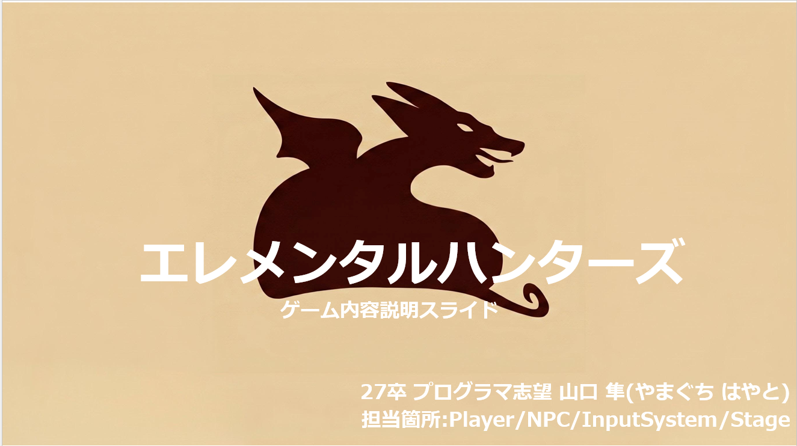
</a>

<a href="Slide/ゲーム概要スライド.pptx" target="_blank">PowerPoint版はこちら</a>

<a href="PDF/ゲーム概要スライド.pdf" target="_blank">PDF版はこちら</a>

ゲームの流れをまとめたスライドです。

---

### 0-3.技術紹介スライド

<a href="Image/技術紹介スライド_サムネ.png" target="_blank">
  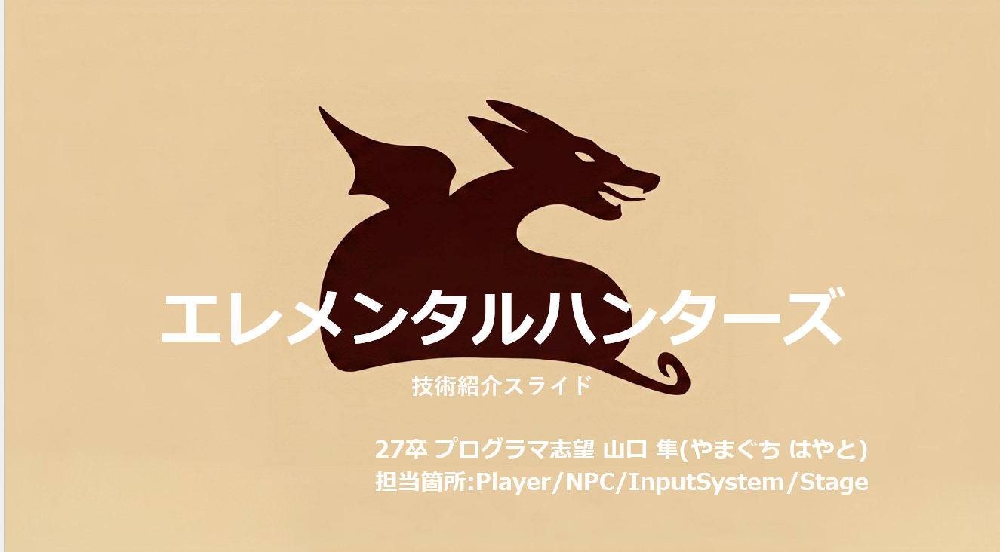
</a>

<a href="Slide/技術紹介スライド.pptx" target="_blank">PowerPoint版はこちら</a>

<a href="PDF/技術紹介スライド.pdf" target="_blank">PDF版はこちら</a>

実装技術を簡易的に説明したスライドです。

---

## 1.プロフィール

| 項目 | 内容 |
|---|---|
| 氏名 | 山口 隼（ヤマグチ ハヤト） |
| 所属 | 河原電子ビジネス専門学校 ゲームクリエイター科 27卒 |
| 希望職種 | ゲームプログラマ |
| Email | CA01244029@st.kawahara.ac.jp |

### 強み

ゲームにおける操作感やアクションの仕組みを分析し、C++で設計・実装することを強みとしています。

本ポートフォリオでは、チーム制作で担当したプレイヤーアクション、NPC制御、キャラクターごとの攻撃処理、入力処理、弾・魔法の生成処理を中心にまとめています。

また、課題に対して「どうクラスを分ければ保守性が上がるか」「どう処理を分離すれば調整しやすくなるか」を考えながら、Stateパターン、Adapterパターン、Factoryパターンを用いて実装しました。

---

## 2.作品概要

| 項目 | 内容 |
|---|---|
| 作品名 | ELEMENTAL HUNTERS |
| ジャンル | 3Dモデルを用いた2D視点アクションゲーム |
| 制作形式 | チーム制作 |
| 制作人数 | 3人 |
| プレイ人数 | 1〜4人 |
| 使用言語 | C++14 |
| 使用技術 | DirectX |
| 開発環境 | Visual Studio 2022 / 学内エンジン |
| バージョン管理 | GitHub / Forkクライアント |
| 連絡手段 | Teams |

---

## 3.チーム構成と担当箇所

### 3-0.開発チーム構成

| 担当 | 人数 | 内容 |
|---|---:|---|
| アウトゲーム全般 | 1人 | UI / 演出 / ゲームフロー全体の管理 |
| インゲーム | 2人 | Bossキャラクター / NPC / Player / ステージ制御 |

計3人で制作しました。

---

### 3-1.担当箇所
<a href="Image/ScopeResponsibility.png" target="_blank">
  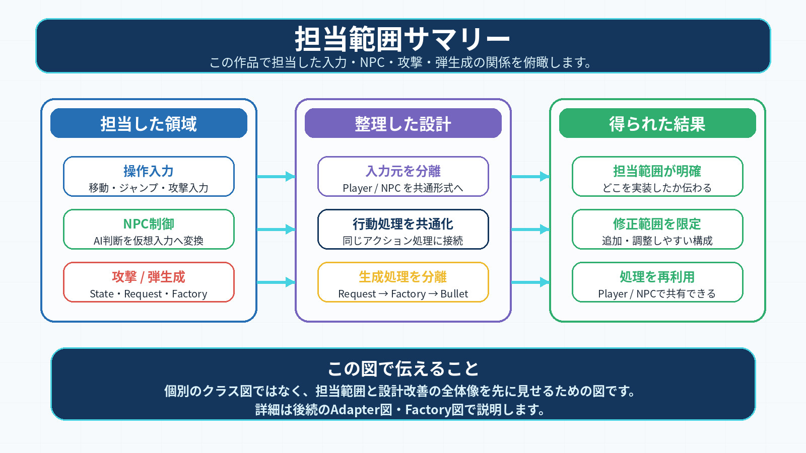
</a>

上図は、担当した操作入力・NPC制御・攻撃処理・弾生成処理の関係をまとめたものです。
個別の技術説明に入る前に、担当範囲の全体像を把握できるようにしています。

#### プレイヤー・キャラクター実装

- プレイヤーキャラクターの基本動作実装
- Sword / Hammer / Wand / TwinGunCharacter のアクション実装
- キャラクターごとの攻撃処理、チャージ攻撃、空中攻撃、連続攻撃の実装
- ガード機能、復活システム、ヒットストップの実装

#### アクション・状態管理

- Player用ステートマシンの実装
- Idle / Run / Jump / Attack / Hit / Death などの状態管理
- 階層型ステートによる攻撃アクション管理
- コンボルート、攻撃パラメータ、ダメージ倍率の管理

#### NPC・入力処理

- NPCキャラクターの行動ロジック実装
- ターゲットへの接近、武器ごとの攻撃、味方救出行動の実装
- GamePadInputAdapter / VirtualInputAdapter による入力処理の分離
- PlayerとNPCが同じアクション処理を使える入力経路の構築

#### 弾・魔法・生成処理

- WandCharacter の魔法・ミサイル攻撃実装
- TwinGunCharacter の弾丸攻撃実装
- BulletFireRequest / BulletFactory による弾生成処理の分離
- Magic / Gun関連処理のFactory化

#### モデル・アニメーション・演出管理

- モデル管理クラスの実装
- 基本動作用アニメーション、武器用アニメーションの管理
- BGM / SE / Effect管理クラスの実装
- ダメージ数表示、攻撃時エフェクト、復活演出などの実装

#### ステージ・背景

- ステージモデルの追加

---

## 4.ゲームの特徴

### 4-1.どんなゲームか
<a href="Image/GameFlow.png" target="_blank">
  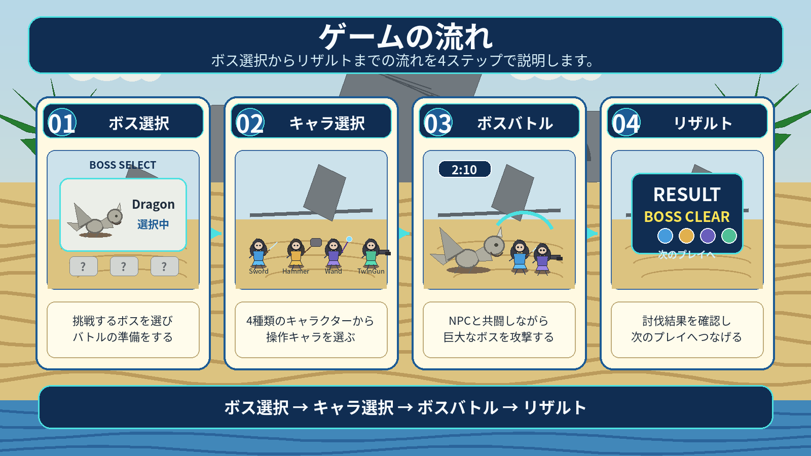
</a>

ゲームサイクルの流れをまとめています。

ELEMENTAL HUNTERSは、最大4人でボス討伐に挑む、3Dモデルを用いた2D視点アクションゲームです。

プレイヤーは、剣・ハンマー・杖・銃など性能の異なるキャラクターを操作し、制限時間内にボスの撃破を目指します。

ソロプレイ時はNPCと共闘できるため、1人でも複数キャラクターで戦っているような体験を目指しました。

| 要素 | 内容 |
|---|---|
| 目的 | 制限時間内にボスを討伐する |
| 遊び方 | キャラクターごとの攻撃を使い分けて戦う |
| 特徴 | NPCと共闘できる |
| プレイ感 | スピーディーなボス討伐アクション |

---

### 4-2.何が面白いか

本作品の面白さは、武器ごとに異なる攻撃アクションを使い分けながら、ボスを攻略することです。

Bボタンの単発入力、連打、長押し、ジャンプ中入力、ダッシュ中入力によって攻撃が変化します。

そのため、同じキャラクターでも状況に応じて攻撃方法を選びながら戦えます。

また、NPCと共闘することで、ソロプレイでもパーティで戦っている感覚を出しています。

---

## 5.操作方法

### 5-1.基本操作

<a href="Image/操作説明.png" target="_blank">
  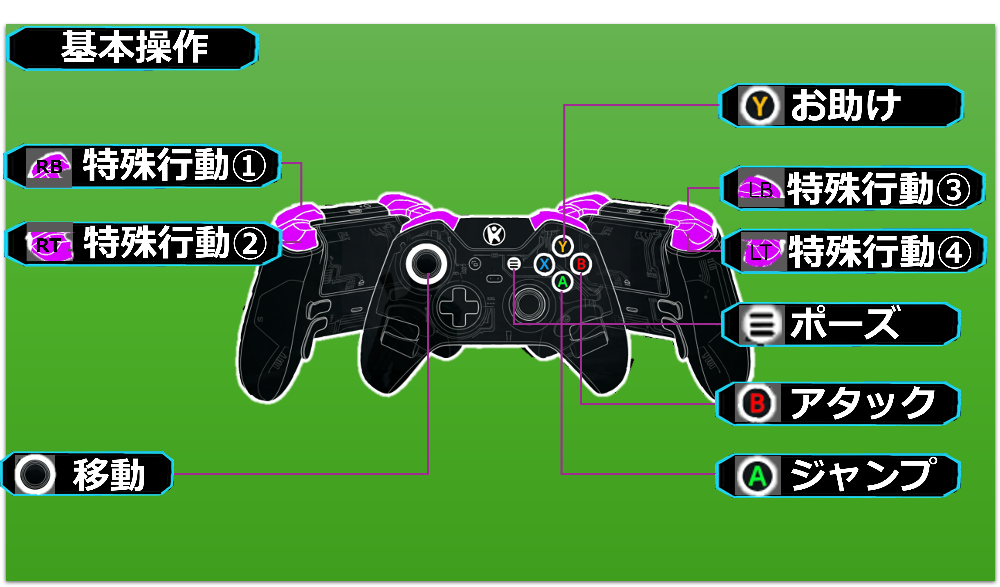
</a>

移動 / ジャンプ / 攻撃などの基本動作をまとめています。  
また、攻撃は同じBアクションでも入力状態によって異なるアクションができます。  
※5-2を参照

---

### 5-2.攻撃方法

<a href="Image/AttackInputFlow_clean.png" target="_blank">
  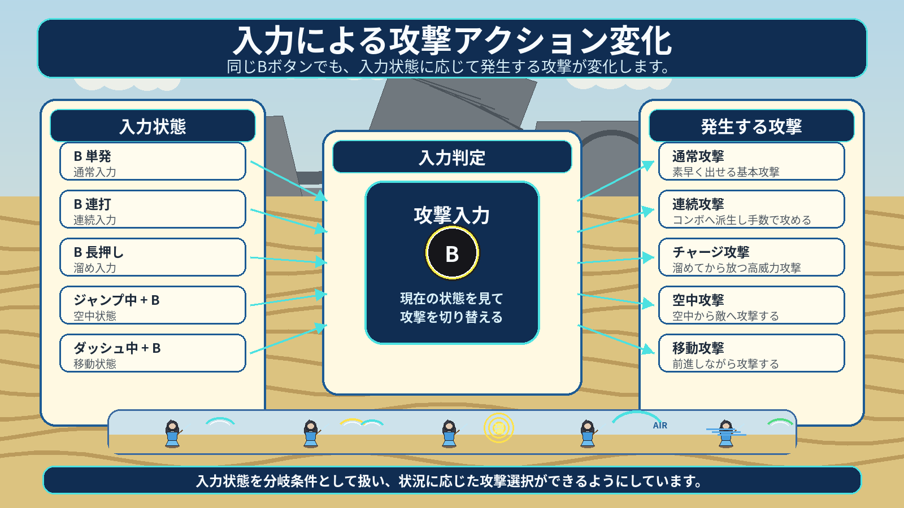
</a>

Bボタンの単発入力、連打、長押し、ジャンプ中入力、ダッシュ中入力などにより、通常攻撃、連続攻撃、チャージ攻撃、空中攻撃、移動攻撃へ派生します。これにより、プレイヤーは状況に応じて攻撃方法を選びながら戦えます。

本作品では、同じBボタンでも入力状態によって攻撃内容が変化します。
※Combo 1〜3は固有の技名ではなく、武器種や状態に応じて派生する共通コンボアクションとして表記しています。

---

### 5-3.復活システム

他キャラクターのHPが0になった際、近くでYボタンを押すことで数秒間かけて復活させることができます。  
復活中は無防備になってしまうため、タイミングが重要になります。

<video src="./Video/ReboneSystem.mp4" controls width="100%"></video>

---

## 6.キャラクター紹介

### 6-1.キャラクター紹介PV

<video src="./Video/CharacterPV.mp4" controls width="100%"></video>

各キャラクターの攻撃アクションや役割を確認できる紹介動画です。  

<a href="Image/CharacterComparison.png" target="_blank">
  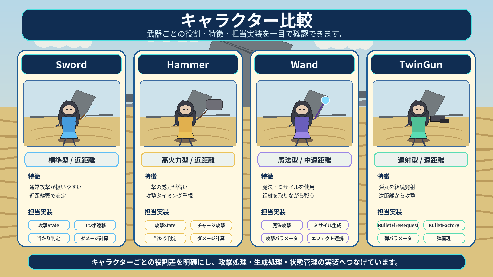
</a>

4種類のプレイアブルキャラクターについて、武器ごとの役割や攻撃スタイルの違いをまとめています。

---

### 6-2.SwordCharacter

| 項目 | 内容 |
|---|---|
| 役割 | 近距離で安定して攻撃できる標準キャラクター |
| 特徴 | 通常攻撃、チャージ攻撃、空中攻撃を使い分けて戦う |
| 担当した実装 | 攻撃State / コンボ遷移 / 当たり判定 / ダメージ計算 |

---

### 6-3.HammerCharacter

| 項目 | 内容 |
|---|---|
| 役割 | 高火力の近距離キャラクター |
| 特徴 | 攻撃の重さと威力を重視し、攻撃タイミングが重要 |
| 担当した実装 | 攻撃State / チャージ攻撃 / 当たり判定 / ダメージ計算 |

---

### 6-4.WandCharacter

| 項目 | 内容 |
|---|---|
| 役割 | 魔法や遠距離攻撃を扱うキャラクター |
| 特徴 | 攻撃ごとに異なる魔法・ミサイルを使い分けて戦う |
| 担当した実装 | 魔法攻撃 / ミサイル生成 / 攻撃パラメータ管理 |

---

### 6-5.TwinGunCharacter

| 項目 | 内容 |
|---|---|
| 役割 | 遠距離から継続的に攻撃するキャラクター |
| 特徴 | 弾丸の種類や発射タイミングを切り替えて戦う |
| 担当した実装 | BulletFireRequest / BulletFactory / 弾丸パラメータ管理 |

---

## 7.技術的工夫点

### 7-0.技術的に特に見てほしい点

| 技術項目 | 見てほしい理由 |
|---|---|
| キャラクター共通基盤 | キャラクターごとの重複処理を整理し、武器ごとの差分を分離したため |
| 階層型State + コンボテーブル | アクション追加や攻撃調整をしやすい構成にしたため |
| 入力Adapter / NPC制御 | 物理入力と仮想入力を共通化し、PlayerとNPCの挙動差を抑えたため |
| BulletFireRequest / Factory | 攻撃Stateから弾生成処理を分離し、修正箇所を限定したため |
| モデル・アニメーション管理 | キャラクターごとのモデルやアニメーションを共通管理しやすくしたため |
| BGM / SE / Effect管理 | サウンドやエフェクトの登録・再生処理を整理し、演出を追加しやすくしたため |

---

### こだわった箇所

<a href="Image/こだわった箇所.png" target="_blank">
  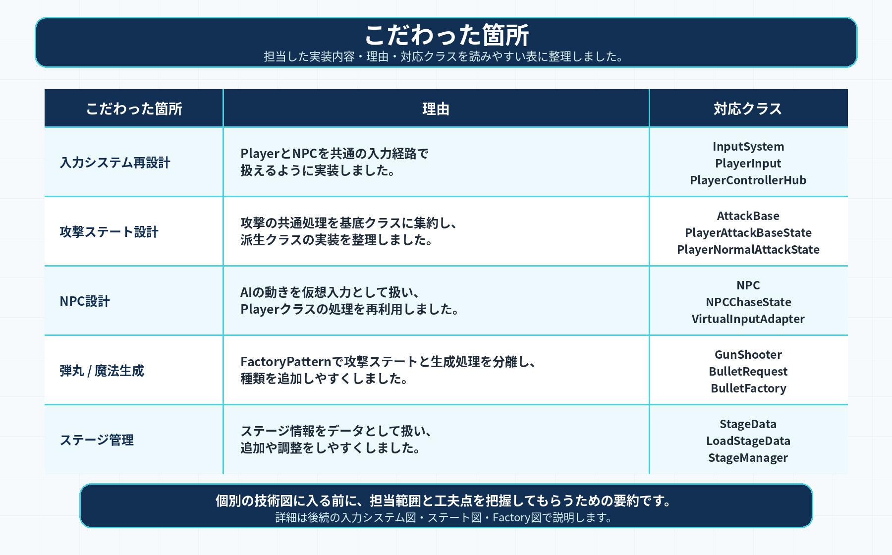
</a>

---

### 7-1.クラス設計の見直し（キャラクターの共通化）

#### 課題

当初はキャラクターごとに移動、HP管理、アニメーション、攻撃処理を個別に実装していたため、同じような処理が複数のクラスに分散し、修正箇所の視認性が悪い状態でした。

#### どう工夫したか

キャラクターの基底として「ICharacter」を用意し、HPや攻撃ステータス、モデル管理など、実体を持つキャラクターに共通する処理をまとめました。  
さらに、プレイヤーとして操作可能なキャラクターは「Player」を中心にし、武器ごとの差分は「IWeaponCharacter」から派生するSwordCharacter、HammerCharacter、WandCharacter、TwinGunCharacterに分けました。

<a href="Image/Character.png" target="_blank">
  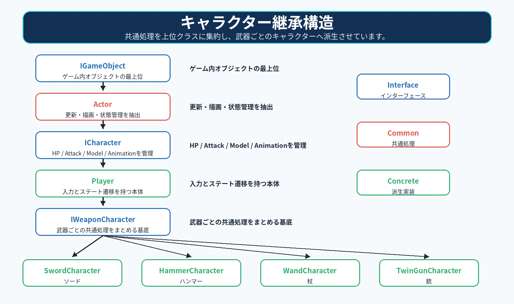
</a>

#### 結果

キャラクター本体の共通処理と、武器ごとの固有処理を分けられたため、武器追加時に既存のPlayer処理を大きく変更せずに拡張できる構成になりました。

---

### 7-2.階層型ステートパターンの導入によるアクション管理

#### 課題

アクションを作る際、コンボの派生条件や技ごとのダメージ設定を全てコード内にif文で書くと、技が増えるたびにコードが複雑になり、調整も困難でした。

<a href="Image/PlayerStateStructure.png" target="_blank">
  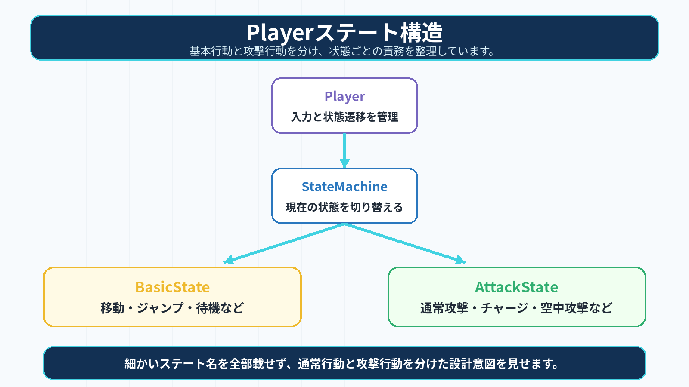
</a>

#### どう工夫したか

攻撃の土台となる「PlayerAttackBaseState」を作り、各攻撃技がそれを引き継ぐ階層型ステートを実装しました。  
コンボルートやダメージ倍率は構造体のテーブルとして独立させ、ロジックから切り離しました。  
また、テーブルの中から今の技に合うデータを探し出し、適用するように実装しています。

#### 結果

コードを直接書き換えなくても、テーブルの数値を変更するだけで技の強さやコンボのつながりを変えられるようになり、拡張性が向上しました。

---

### 7-3.テーブルによるコンボ / 攻撃ステータス管理

#### 課題

攻撃ごとの派生条件やダメージ倍率をステートクラス内に直接書くと、技が増えるたびに条件分岐が増え、調整しづらくなる問題がありました。

#### どう工夫したか

コンボの派生条件は「ComboRouteTable」、攻撃ごとのダメージ倍率やクリティカル補正は「AttackParameterTable」に分離しました。  
ステート側では、現在の状態IDと入力条件をもとにテーブルを検索し、次の状態や攻撃パラメータを取得する形にしています。

#### 結果

攻撃ステート側の処理を増やしすぎず、コンボルートやダメージ倍率の調整をテーブル側で行えるようになりました。  
これにより、アクションの調整作業とロジックの実装を分離でき、保守性と調整効率を高めることができました。

---

### 7-4.旧入力システム VS 新入力システム

#### Adapterパターンによる入力責務の分離

#### 課題

旧設計では、PlayerInputクラス内で物理コントローラー入力とNPC用の仮想入力を分岐して処理していました。  
そのため、PlayerInputが「入力元の判定」と「ゲームアクションへの変換」の両方を担当しており、操作キャラクター切り替えやNPC制御を拡張しづらい構造になっていました。

<a href="Image/inputSystem.png" target="_blank">
  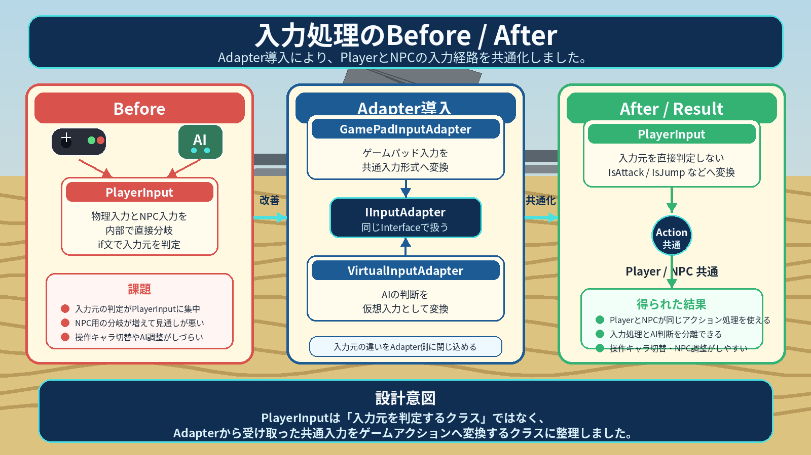
</a>

旧設計では、PlayerInputが物理入力とNPC入力の分岐を直接持っていました。
改修後はAdapterPatternを導入し、PlayerInputは入力元を意識せず、ゲームアクションへの変換に集中できる構成にしました。

#### どう工夫したか

AdapterPatternを導入し、物理コントローラークラスと仮想コントローラークラスに分離しました。  
PlayerInputは入力元を直接判定せず、親クラス経由で取得した入力をIsJump、IsAttack、IsChargeAttackなどのゲームアクションへ変換する役割に限定しました。  
また、PlayerControllerHubを用意し、操作中のキャラクターにはGamePadInputAdapter、非操作キャラクターにはVirtualInputAdapterを割り当てることで、キャラクターを再生成せずに操作対象を切り替えられる構成にしました。

<a href="Image/NPCVirtualInputStructure.png" target="_blank">
  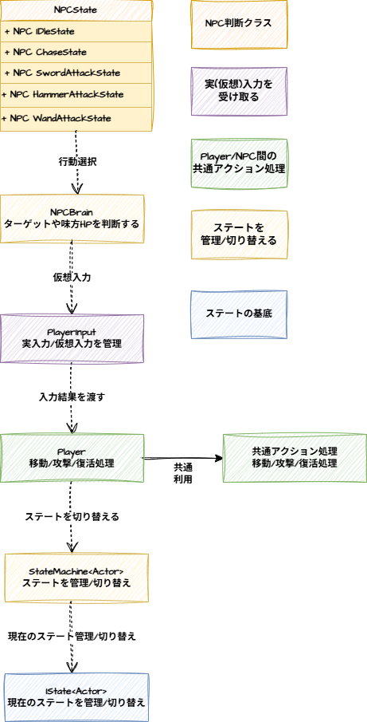
</a>

#### 結果

PlayerInputから入力元判定のif分岐を削除でき、物理入力とNPC入力を同じ経路で扱えるようになりました。  
NPCはAIが仮想入力を送ることでPlayerと同じアクション処理を利用できるため、プレイヤー操作キャラクターとNPCキャラクターの挙動差を抑えられました。  
また、共通の入力経路を使うことで、AI側の判断処理を独立して調整できるようになりました。

---

### 7-5.発射リクエスト / Factoryによる生成システムの構築

#### 課題

銃キャラクターの攻撃を実装する際、各攻撃Stateが弾丸の生成、モデル情報、速度、寿命、発射位置、エフェクト通知まで直接持ってしまうと、ステートクラスが肥大化してしまう問題がありました。

<a href="Image/FactoryPattern.png" target="_blank">
  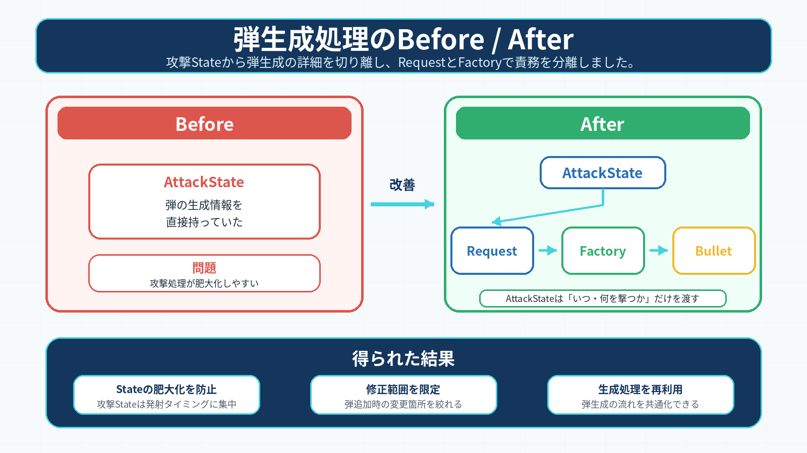
</a>

以前は、攻撃Stateが弾の種類や生成情報を直接持っていたため、処理が肥大化しやすい状態でしたが、
改修後は、攻撃StateからBulletFireRequestを渡し、Factory側で弾生成を行うことで、責務を分離しました。

#### どう工夫したか

攻撃ステートからは「BulletFireRequest」として弾の種類・生成基準位置・発射方向だけを「GunShooter」へ渡す形にしました。  
「GunShooter」は「BulletFactory」に弾丸生成を依頼し、「BulletFactory」側で「BulletType」に応じた弾丸クラスを生成します。  
また、弾丸ごとの速度、寿命、生成位置補正は「BulletParameterTable」に分離し、モデル情報は「BulletModelRegister」から取得するようにしました。  
発射時のエフェクトなどは「IBulletFireListener」へ通知することで、弾丸生成処理と演出処理を分けています。

<a href="Image/BulletGenerationSystemStructure.png.png" target="_blank">
  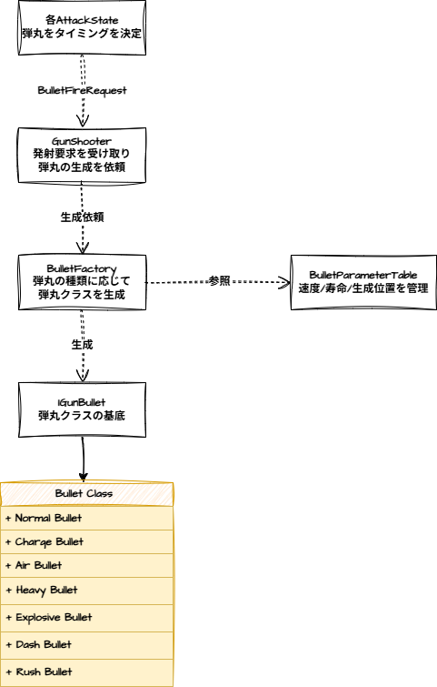
</a>

#### 結果

攻撃ステートは発射タイミングと発射する弾丸の種類のみを扱うだけとなり、生成処理やパラメータ管理を別クラスに分離できました。  
その結果、弾の種類追加や速度調整を行う際の修正箇所を限定しやすくなりました。

---

### 7-6.データ駆動によるステージ読み込みシステムの構築

#### 課題

既存の設計ではステージごとにクラスを作成しており、ステージが増えるたびに同じような処理が増え、コピーコードが量産されていました。

#### どう工夫したか

ステージの情報を描画、座標、モデルパスなどの構成データに分離しました。  
ステージごとの固有データは構造体にまとめ、LoadStageDataクラスが識別子を受け取るだけで、そのステージを自動で読み込めるように設計しました。

#### 結果

ステージが増えてもクラス数は増えず、ステージデータの登録のみで運用できる形になり、開発効率が向上しました。

---

## 8.今後の展望

- リファクタリング
  - 階層型ステートパターンにイテレーターパターンを導入予定です。

- ステージの追加
  - ステージを2〜3種類追加予定です。

- Ultimate Abilityの実装
  - ボスのHPの減少割合に応じてコレクションアイテムを出現させ、全て集めるとボスに大ダメージを与えられるように実装予定です。

---

## 9.リンク集

- Youtube: [こちらからアクセスできます](https://www.youtube.com/@%E5%B1%B1%E5%8F%A3%E9%9A%BC-kawahara)
- Googleドライブ: [こちらからアクセスできます](https://drive.google.com/drive/folders/1uRL0AiCKYP2HvznbBXS_wLJY3bZnr4bU?usp=drive_link)
- GitHub: [こちらからアクセスできます](https://github.com/TanimotoYuuki/Project-EH)
- 過去作品（個人制作）: [こちらからアクセスできます](https://github.com/YamaguchiHayato/Dimensional-Flip)
- 過去開発（チーム開発）: [こちらからアクセスできます](https://github.com/TanimotoYuuki/EhimeGuri)