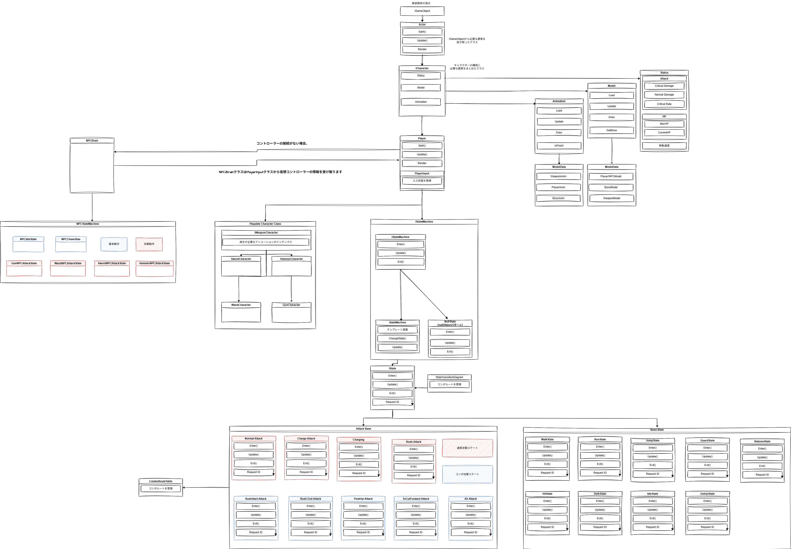

<link rel="stylesheet" href="style.css">

# ELEMENTAL HUNTERS  

## Image 01: タイトル画面

 

## 目次
- ## 1. [プロフィール](#1プロフィール)
- ## 2. [作品概要](#2作品概要)
- ## 3. [チーム構成と担当箇所](#3チーム構成と担当箇所)
  ## &emsp; 3-0.[開発チーム構成](#part3-0)
  ## &emsp; 3-1.[担当箇所](#part3-1)
- ## 4. [ゲームの特徴](#4-ゲームの特徴)
  ## &emsp; 4-1[ゲームの特徴](#part4-1)
  ## 5. [操作方法](#5-操作方法)
  ## &emsp; 5-1.[基本操作](#part5-1)
  ## &emsp; 5-2.[復活システム](#part5-2)
  ## &emsp; 5-3.[攻撃方法](#part5-3)
- ## 6.[技術的工夫点](#6技術的工夫点)
  ## &emsp; 6-1.[クラス設計の見直しについて](#part6-1)
  ## &emsp; 6-2.[階層型ステートパターンの導入](#part6-2)
  ## &emsp; 6-3.[キャラクターの全体設計図](#part6-3)
  ## &emsp; 6-4.[データ駆動によるステージの読み込みシステムの構築](#part6-4)
- ## 7. [今後の展望](#7今後の展望)
- ## 8. [リンク集](#8-リンク集) 
****

## 1.プロフィール

- ## 氏名: 山口 隼(ヤマグチ ハヤト)
  
- ## 所属: 河原電子ビジネス専門学校 ゲームクリエイター科 27卒
  
- ## 希望職種: プログラマ
  
- ## Email: CA01244029@st.kawahara.ac.jp
****

## 2.作品概要

-  ## 使用言語: 
   ## &emsp; C++14  
   ## &emsp; DirectX

- ## 開発環境: 
   ## &emsp; VisualStudio 2022  
   ## &emsp; 学内エンジン

- ## 開発ツール: 
  ## &emsp; バージョン管理: GitHub / Forkクライアント
  ## &emsp; 連絡手段: Teams
****

## 3.チーム構成と担当箇所

- ## 3-0.開発チーム構成:
  - ## アウトゲーム全般担当:1人
    ## &emsp; UI/演出/ゲームフロー全体の管理

   

  - ## インゲーム担当2人 
    ## &emsp; Bossキャラクター/NPC担当
    ## &emsp; Playerキャラクター/ステージ制御担当

  ## 計3人構成
****

- ## 3-1.担当箇所：
  ## &emsp; ステージモデルの制作
  ## &emsp; ステージの読み込み・進行管理システムの構築
  ## &emsp; プレイヤーアクションの設計・実装（状態遷移、コンボルート等）
  ## &emsp; NPCキャラクターの実装。
  ## &emsp; 武器の当たり判定とダメージ計算の実装
  ## &emsp; ダメージポップアップの演出・UI実装
****

- ## 4.ゲームの特徴
  - ## 4-1.ゲームの特徴
    ## ■ 特徴-1 共闘ができるアクションゲーム。
    ## &emsp; ユーザーとNPCが共闘する3Dアクションゲームです。
    ## &emsp; 勿論ソロプレイも可能となっています。
  
  - ## ■ 特徴-2 ボスの討伐のために繰り広げられるスピーディーなバトル
    ## &emsp; 制限時間以内にボスの討伐を行うことがゲームクリアの目的となっています。
    ## &emsp; また、攻撃を組み合わせることでコンボを発動することも可能となっており攻撃手段の幅を増やしています。
****

## 5.操作方法
  - ## 5-1.基本操作
    - ## 移動: Lスティック
    - ## ジャンプ: A
    - ## ダッシュ: LB + B
    - ## ガード: LT(背面)
    - ## 復活システム発動: Y    

  - ## 5-2.復活システム
    - ## 概要: 他キャラクターのHPが0になった際、近くでYボタンを押すことで数秒間かけて復活をさせることができます。
    <video src="./Video/ReboneSystem.mp4" controls width="100%"></video>

  - ## 5-3.攻撃方法
    - ## 種類とボタン配置(動画はソードキャラクターのものとなっています。)
      - ## 通常攻撃: Bを単発で押す。
      <video src="./Video/NormalAttack.mp4" controls width="100%"></video>
 
      - ## チャージ攻撃: Bを長押し
      <video src="./Video/ChargeAttack.mp4" controls width="100%"></video>

      - ## 連続攻撃: Bを連打
      <video src="./Video/RushAttack.mp4" controls width="100%"></video>
 
      - ## 斬り進む攻撃: ダッシュ状態でB
      <video src="./Video/ToCutForward.mp4" controls width="100%"></video>

      - ## 空中攻撃: ジャンプ状態でB
      <video src="./Video/AirAttack.mp4" controls width="100%"></video>
****

## 6.技術的工夫点 
- ## 6-1.クラス設計の見直し（キャラクターの共通化）
    ## ■ 課題
    ## &emsp; 当初はプレイヤーやNPCごとに別々のクラスを作成しており、似たような処理を何度も書く必要があったため、クラスが肥大化し保守性に欠けていました。

    ## ■ どう工夫したか
    ## &emsp; すべてのキャラクターの土台となる「ICharacter」クラスを作成し、PlayerやNPCはそこから共通機能（移動やHP管理など）を引き継ぐ設計に変更しました。
    ## &emsp; さらに武器ごとの固有処理は「IWeaponCharacter」からプレイアブルキャラクタークラスへと派生する形（SwordCharacterなど）に分けました。

    ## ■ 結果
    ## &emsp; 共通の仕組みを1箇所にまとめられたため、コードの重複がなくなり、メンテナンスが楽になりました。

  - ## 6-2.階層型ステートパターンとデータ検索の導入
    ## ■ 課題
    ## &emsp; アクションを作る際、コンボの派生条件や技ごとのダメージ設定を全てコード内にif文で書くと、技が増えるたびにコードがごちゃごちゃになり、調整も困難でした。

    ## ■ どう工夫したか
    ## &emsp; 攻撃の土台となる「PlayerAttackBaseState」を作り、各技がそれを引き継ぐ階層型。
    ## &emsp; コンボルートやダメージ倍率は構造体のテーブルとして独立させ、ロジックから切り離しました。
    ## &emsp; テーブルの中から今の技に合うデータを探し出し適応するように実装しています。

    ## ■ 結果
    ## &emsp; コードを直接書き換えなくても、テーブルの数値をいじるだけで技の強さやコンボの繋がりを瞬時に変えられるようになり、拡張性が大きく向上しました。

  - ## 6-3.データ駆動によるステージ読み込みシステムの構築
    ## ■ 課題
    ## &emsp; 既存の設計ではステージごとにクラスを作成しており、ステージが増えるたびに同じような処理が増え、コピーコードが量産されていました。

    ## ■ どう工夫したか
    ## &emsp; ステージの情報を描画と座標やモデルパスなどの構成データに分離しました。
    ## &emsp; ステージごとの固有データは構造体にまとめ、LoadStageDataクラスが識別子を受け取るだけで、そのステージを自動で読み込めるように設計。

    ## ■ 結果
    ## &emsp; ステージがどれだけ増えてもクラス数は増えず、ステージデータの登録のみで運用できる形になり、開発効率が向上しました。

  - ## 6-4.入力の抽象化によるNPC（AI）システムの構築
    ## ■ 課題
    ## &emsp; プレイヤーと一緒に戦うNPCを実装する際、Playerクラス/NPCクラスと分けてしまうと、攻撃処理やステートマシンのコードが完全に重複してしまう問題がありました。

    ## ■ どう工夫したか
    ## &emsp; キャラクターの操作と本体を切り離し、入力の抽象化を行いました。
    ## &emsp; 入力情報を管理するクラスに、実際のゲームパッド入力とは別に「仮想ボタン」の仕組みを追加。
    ## &emsp; NPC専用の「NPCBrainクラス(NPCStateMachine)」を作成。
    ## &emsp; NPCとして生成された場合、NPCBrainが独自の思考で入力情報を管理するクラスの仮想ボタンを押すようにしました。

    ## ■ 結果
    ## &emsp; AIが「見えないコントローラー」を操作している状態になり、Playerのアクション処理を一切書き換えることなく、全く同じ挙動でNPCを動かすことに成功しました（コンポーネント指向の実現）。

   - ## 6-5.全体のクラス設計と状態遷移の仕組み
     - ## クラス設計
     
## &emsp;        
****

## 7.今後の展望
- ## リファクタリング
  ## &emsp; 階層がステートパターンにイテレーターパターンを導入。
  ## &emsp; また、テンプレートメソッドパターンも導入予定。
  ## &emsp; 入力システムクラスにアダプターパターンを導入。

- ## ステージの追加
  ## &emsp; こちらも同様に2～3種類追加予定です。

- ## Ultimate Abilityの実装
  ## &emsp; ボスのHPの減少割合に応じてコレクションアイテムを出現させ、全て集めるとボスに大ダメージを与えれるように実装予定です。

****

## 8. リンク集
- ## Youtube: [こちらからアクセスできます](https://www.youtube.com/@%E5%B1%B1%E5%8F%A3%E9%9A%BC-kawahara)
  
- ## Googleドライブ: [こちらからアクセスできます](https://drive.google.com/drive/folders/1uRL0AiCKYP2HvznbBXS_wLJY3bZnr4bU?usp=drive_link)

- ## GitHub: [こちらからアクセスできます](https://github.com/TanimotoYuuki/Project-EH)

- ## 過去作品(個人制作): [こちらからアクセスできます](https://github.com/YamaguchiHayato/Dimensional-Flip)

- ## 過去開発(チーム開発): [こちらからアクセスできます](https://github.com/TanimotoYuuki/EhimeGuri)
****