<link rel="stylesheet" href="style.css">

# ELEMENTAL HUNTERS

**最大4人でボス討伐に挑む、武器ごとの役割とNPC共闘を活かした2D視点アクションゲーム**

<a href="Image/BackGround/title.png" target="_blank">
  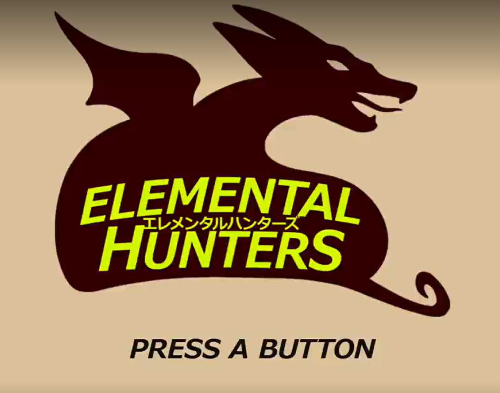
</a>

---

## プロフィール

| 項目 | 内容 |
|---|---|
| 氏名 | 山口 隼（ヤマグチ ハヤト） |
| 所属 | 河原電子ビジネス専門学校 ゲームクリエイター科 27卒 |
| 希望職種 | ゲームプログラマ |
| 使用言語 | C++14 |
| 使用技術 | DirectX |
| 開発環境 | Visual Studio 2022 / 学内エンジン |
| メール | CA01244029@st.kawahara.ac.jp |

### 自己PR

C++を用いたアクションゲーム制作で、プレイヤー操作、攻撃処理、NPC制御など、
ゲームの遊びを支える実装を中心に担当しています。

本作品で担当した箇所は以下の通りになっています。

| 担当箇所 | 内容 |
|---|---|
| プレイヤー操作 | 4種類のキャラクターの基本動作と攻撃アクション部分 |
| 攻撃処理| 階層型StatePatternを用いたコンボや攻撃遷移処理|
| NPCの行動ロジック|プレイアブルキャラができる全行動をロジック化|
| 入力処理| PlayerとNPCの入力処理を共通処理とするAdapterPattern|
| 攻撃オブジェクトの生成管理| FactoryPatternを用いた生成管理|

---

## 最初に見てほしいポイント

| 見てほしい内容 | 理由 |
|---|---|
| PV | ゲーム全体の流れ、キャラクター、ボス戦の雰囲気が短時間で分かるため |
| キャラクター紹介 | 剣・ハンマー・杖・銃の役割やアクション差が分かるため |
| 操作方法・攻撃方法 | 同じ攻撃ボタンでも入力状態によって攻撃が変化する本作の特徴が分かるため |
| 入力Adapter / NPC制御 | PlayerとNPCで同じアクション処理を使えるようにした設計意図が分かるため |
| BulletFireRequest / Factory | 攻撃Stateと弾生成処理を分離した工夫が分かるため |

---

## 作品概要

| 項目 | 内容 |
|---|---|
| 作品名 | ELEMENTAL HUNTERS |
| ジャンル | 3Dモデルを用いた2D視点アクションゲーム |
| 制作形式 | チーム制作 |
| 制作人数 | 3人 |
| プレイ人数 | 1〜4人 |
| 使用言語 | C++14 |
| 使用技術 | DirectX |
| 開発環境 | Visual Studio 2022 / 学内エンジン |
| バージョン管理 | GitHub / Forkクライアント |
| 連絡手段 | Teams |

---

## どんなゲームか

<a href="Image/SystemFlow/GameFlow.png" target="_blank">
  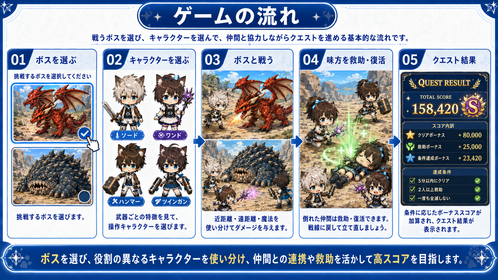
</a>

ELEMENTAL HUNTERSは、最大4人でボス討伐に挑む2D視点アクションゲームです。

プレイヤーは、剣・ハンマー・杖・銃など性能の異なるキャラクターを操作し、
制限時間内にボスの撃破を目指します。

ソロプレイ時はNPCと共闘できるため、1人でも複数キャラクターで戦っているような体験を目指しました。

| 要素 | 内容 |
|---|---|
| 目的 | 制限時間内にボスを討伐する |
| 遊び方 | 武器ごとの攻撃アクションを使い分けて戦う |
| 特徴 | NPCと共闘しながらボスに挑む |
| プレイ感 | スピーディーなボス討伐アクション |

---

## 何が面白いか

本作品の面白さは、武器ごとに異なる攻撃アクションを使い分けながら、ボスを攻略することです。

同じBボタンの攻撃内容が変化します。

そのため、プレイヤーはキャラクターの特徴や状況に応じて、多種多様な攻撃を使い分けながら戦えます。

また、NPCと共闘することで、ソロプレイでもパーティで戦っている感覚を出しています。

---

## ゲーム画面・紹介資料
### PV
| YouTube | [こちらからアクセスできます](https://youtu.be/r-yJ1z-wsVI?si=spdDIfcF9PLhpZsw) |
ゲームの流れ、プレイアブルキャラクターの紹介、ボス戦、戦闘の雰囲気を1分程度で確認できる紹介動画です。

---
### ゲーム紹介スライド

[PowerPoint版はこちら](Slide/ゲーム概要スライド.pptx)

[PDF版はこちら](PDF/ゲーム概要スライド.pdf)

ゲームの流れや基本的な遊び方をまとめたスライドです。

---

### 技術紹介スライド

[PowerPoint版はこちら](Slide/技術紹介スライド.pptx)

[PDF版はこちら](PDF/技術紹介スライド.pdf)

実装面で工夫した設計や処理の分離についてまとめたスライドです。

---

## チーム構成と担当箇所

### チーム構成

| 担当 | 人数 | 内容 |
|---|---:|---|
| アウトゲーム全般 | 1人 | UI / 演出 / ゲームフロー全体の管理 |
| インゲーム | 2人 | Bossキャラクター / NPC / Player / ステージ制御 |

計3人で制作しました。

---

### 担当範囲の概要

<a href="Image/Structure/ScopeResponsibility.png" target="_blank">
  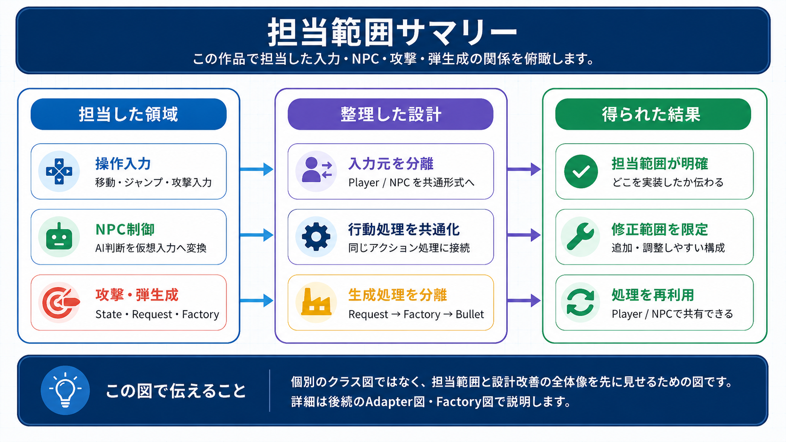
</a>

上図は、担当した操作入力、NPC制御、攻撃処理、弾生成処理の関係をまとめたものです。

個別の技術説明に入る前に、チーム制作の中で自分が担当した範囲を把握しやすいようにしています。

| 担当領域 | 内容 |
|---|---|
| プレイヤー・キャラクター制御 | 4種類のキャラクターの基本動作と攻撃処理 |
| アクション・状態管理 | Idle / Run / Jump / Attack / Hit / Death などの状態管理 |
| NPC制御 | 味方NPCの接近、攻撃、味方救出行動 |
| 入力処理 | GamePadInputAdapter / VirtualInputAdapter による入力処理の分離 |
| 弾・魔法生成 | BulletFireRequest / BulletFactory による弾・魔法生成処理 |
| 演出管理 | BGM / SE / Effect / ダメージ数表示 / 復活演出 |

---

### 基本操作

<a href="Image/Table/操作説明.png" target="_blank">
  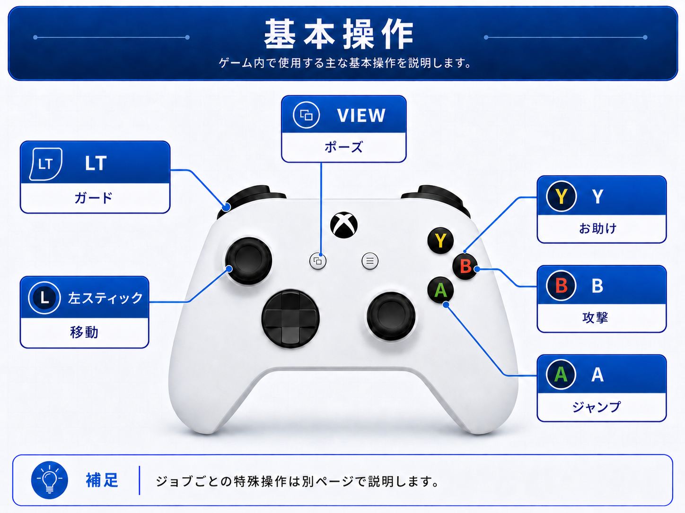
</a>

移動、ジャンプ、攻撃などの基本動作をまとめています。

本作品では、同じBボタンでも入力状態によって異なる攻撃アクションへ派生します。

---

### 攻撃方法

<a href="Image/SystemFlow/AttackInputFlow.png" target="_blank">
  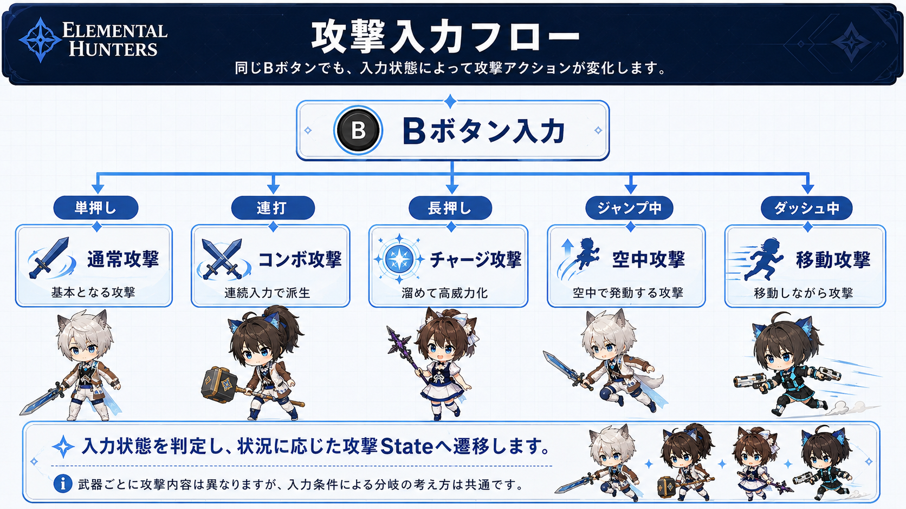
</a>

基本的な攻撃の流れです。

同じBボタンでも条件やタイミングによって様々な攻撃に派生することが可能です。

※Combo 1〜3は固有の技名ではなく、武器種や状態に応じて派生する共通コンボアクションとして表記しています。

---

### 復活システム

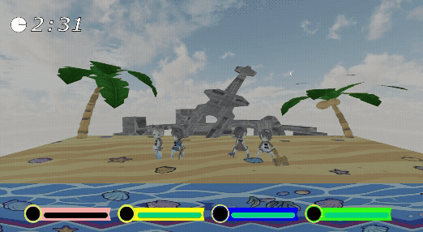

他キャラクターのHPが0になった際、近くでYボタンを押すことで数秒間かけて復活させることができます。

復活中は無防備になるため、復活させるタイミングが重要になります。

---

## キャラクター紹介

<a href="Image/Table/CharacterComparison.png" target="_blank">
  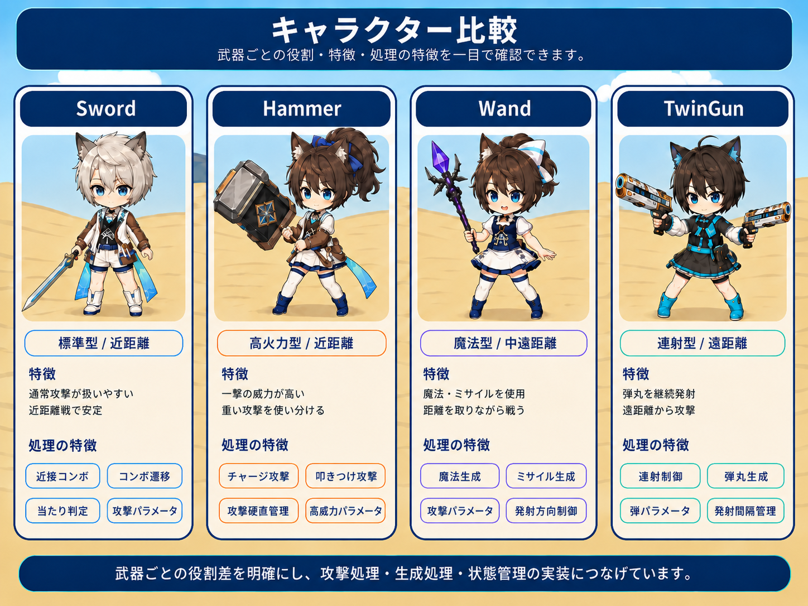
</a>

4種類のプレイアブルキャラクターについて、武器ごとの役割や攻撃スタイルの違いをまとめています。

---

## 技術的に工夫した点

本作品では、デザインパターンを実装するだけでなく、修正や追加を行いやすくすることを重視しました。

| 技術項目 | 理由 |
|---|---|
| キャラクター共通基盤 | キャラクターごとの重複処理を整理し、武器ごとの差分を分離したため |
| 階層型State + コンボテーブル | アクション追加や攻撃調整をしやすい構成にしたため |
| 入力Adapter / NPC制御 | 物理入力と仮想入力を共通化し、PlayerとNPCの挙動差を抑えたため |
| BulletFireRequest / Factory | 攻撃Stateから弾生成処理を分離し、修正箇所を限定したため |
| データ駆動ステージ読み込み | ステージ追加時のコピーコードを減らすため |
| TSVによるパラメータ外部化| 大量のパラメータ調整をコンパイル不要にし、可読性を高めるため|
| ||

---

### 1. クラス設計の見直し（キャラクターの共通化）

<a href="Image/Structure/CharacterStructure.png" target="_blank">
  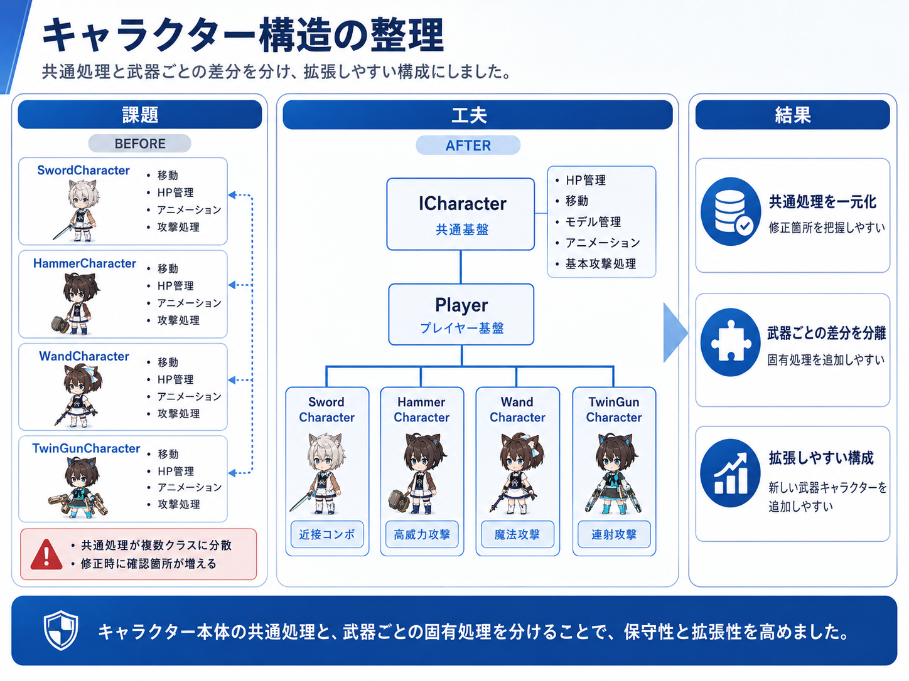
</a>

#### 課題

当初はキャラクターごとに移動、HP管理、アニメーション、攻撃処理を個別に実装していたため、同じような処理が複数のクラスに分散していました。

その結果、共通処理を修正する際に複数クラスを確認する必要があり、修正箇所の視認性が悪い状態でした。

#### 工夫

キャラクターの基底として `ICharacter` を用意し、HP、攻撃ステータス、モデル管理など、実体を持つキャラクターに共通する処理をまとめました。

さらに、プレイヤーとして操作可能なキャラクターは `Player` を中心にし、武器ごとの差分は `IWeaponCharacter` から派生する `SwordCharacter`、`HammerCharacter`、`WandCharacter`、`TwinGunCharacter` に分けました。

#### 結果
キャラクター本体の共通処理と、武器ごとの固有処理を分けられました。
これにより、武器キャラクターを追加する際に既存のPlayer処理を大きく変更せずに拡張できる構成になりました。

---

### 2. 階層型State + コンボテーブルによるアクション管理

<a href="Image/DesignPattern/PlayerStateStructure.png" target="_blank">
  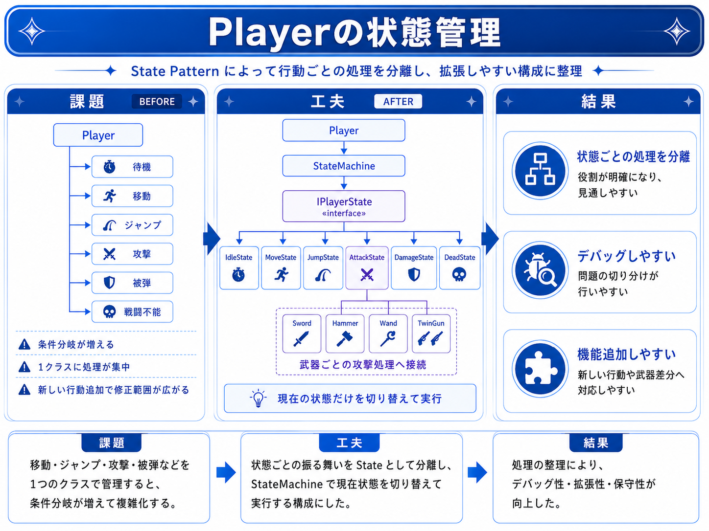
</a>

#### 課題
攻撃アクションを作る際、コンボの派生条件や技ごとのダメージ設定を全てコード内にif文で書くと、
技が増えるたびに条件分岐が増えてしまい、攻撃の追加や数値調整がしづらくなる問題がありました。

#### 工夫
攻撃の土台となる `PlayerAttackBaseState` を作り、各攻撃技がそれを継承する階層型Stateとして実装しました。

また、コンボの派生条件は `ComboRouteTable`、攻撃ごとのダメージ倍率やクリティカル補正は `AttackParameterTable` に分離しました。

ステート側では、現在の状態IDと入力条件をもとにテーブルを検索し、次の状態や攻撃パラメータを取得する形にしています。

#### 結果
攻撃ステート側の処理を増やしすぎず、ルートやダメージ倍率の調整をテーブル側で行えるようになりました。
これにより、アクションの調整作業とロジックの実装を分離でき、保守性と調整効率を高めることができました。

---

### 3. Adapterパターンによる入力責務の分離

<a href="Image/SystemFlow/InputSystemBeforeAfter.png" target="_blank">
  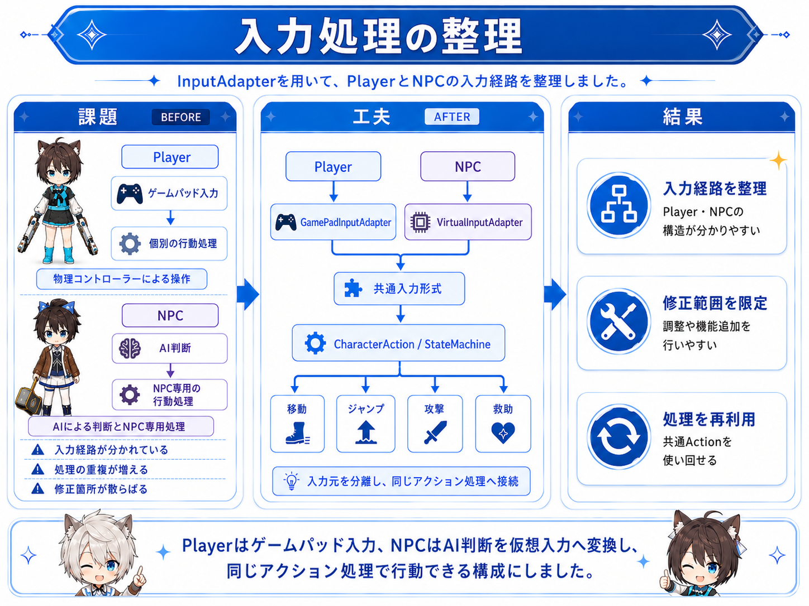
</a>

#### 課題

旧設計では、`PlayerInput` クラス内で物理コントローラー入力とNPC用の仮想入力を分岐して処理していました。

そのため、`PlayerInput` が「入力元の判定」と「ゲームアクションへの変換」の両方を担当しており、
操作キャラクター切り替えやNPC制御を拡張しづらい構造になっていました。

#### 工夫

Adapterパターンを導入し、物理コントローラー用の `GamePadInputAdapter` と、NPC用の `VirtualInputAdapter` に分離しました。

`PlayerInput` は入力元を直接判定せず、親クラス経由で取得した入力を `IsJump`、`IsAttack`、`IsChargeAttack` などのゲームアクションへ変換する役割に限定しました。

また、`PlayerControllerHub` を用意し、操作中のキャラクターには `GamePadInputAdapter`、
非操作キャラクターには `VirtualInputAdapter` を割り当てることで、キャラクターを再生成せずに
操作対象を切り替えられる構成にしました。

<a href="Image/SystemFlow/NPCVirtualInputStructure.png" target="_blank">
  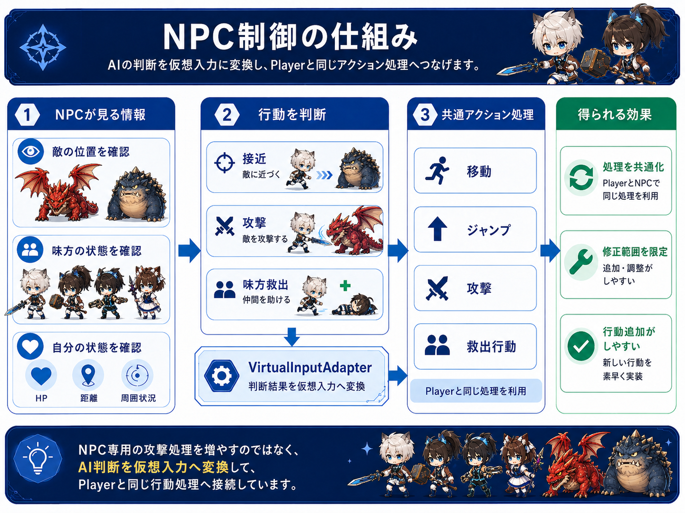
</a>

#### 結果

`PlayerInput` から入力元判定のif分岐を削除でき、物理入力とNPC入力を同じ経路で扱えるようになりました。

NPCはAIが仮想入力を送ることでPlayerと同じアクション処理を利用できるため、プレイヤー操作キャラクターとNPCキャラクターの挙動差を抑えられました。

---

### 4. BulletFireRequest / Factoryによる生成システムの構築

<a href="Image/DesignPattern/FactoryPattern.png" target="_blank">
  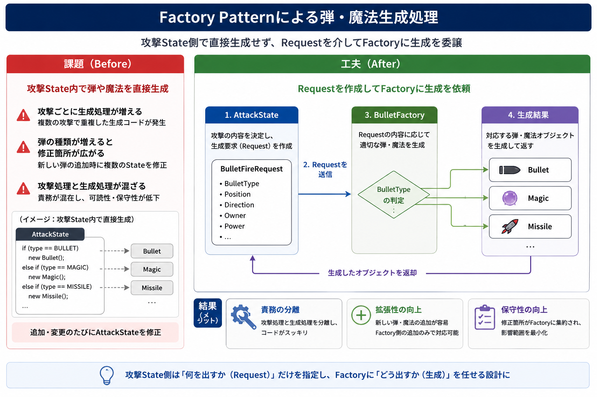
</a>

#### 課題

銃キャラクターの攻撃を実装する際、各攻撃Stateが弾丸の生成、モデル情報、などを直接持ってしまうと、
ステートクラスが肥大化してしまう問題がありました。

#### 工夫

攻撃ステートからは `BulletFireRequest` として、弾の種類、生成基準位置、発射方向だけを `GunShooter` へ渡す形にしました。

`GunShooter` は `BulletFactory` に弾丸生成を依頼し、`BulletFactory` 側で 
`BulletType` に応じた弾丸クラスを生成します。

また、弾丸ごとの速度、寿命、生成位置補正は `BulletParameterTable` に分離し、
モデル情報は `BulletModelRegister` から取得するようにしました。

発射時のエフェクトなどは `IBulletFireListener` へ通知することで、弾丸生成処理と演出処理を分けています。

<a href="Image/SystemFlow/BulletGenerationSystemStructure.png" target="_blank">
  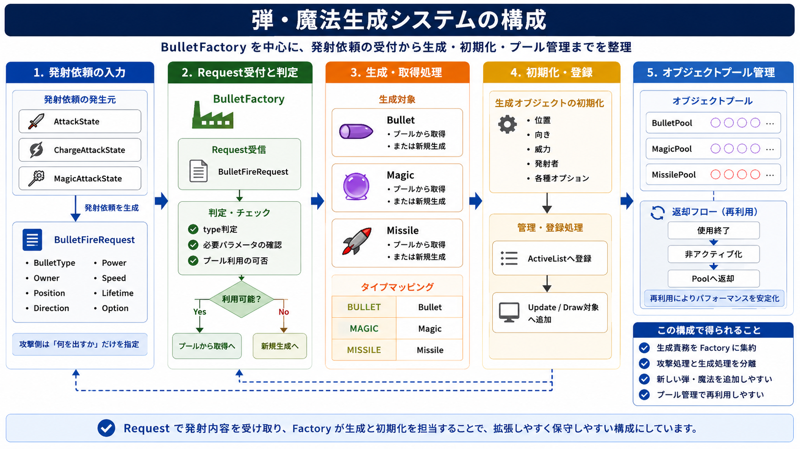
</a>

#### 結果

攻撃ステートは発射タイミングと発射する弾丸の種類のみを扱う形になりました。
その結果、弾の種類追加や速度調整を行う際の修正箇所を限定しやすくなりました。

---

### 5. データ駆動によるステージ読み込みシステムの構築

<a href="Image/SystemFlow/データ駆動ステージ読み込みの効果.png" target="_blank">
  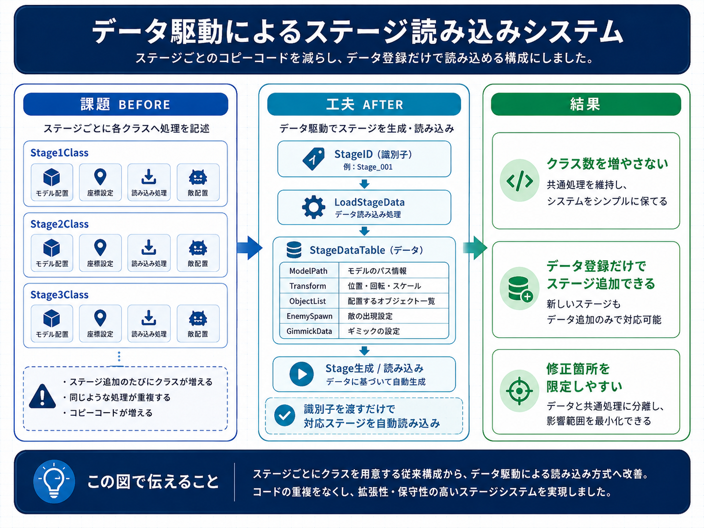
</a>

#### 課題

既存の設計ではステージごとにクラスを作成していたため、ステージが増えるたびに同じような処理が増え、
コピーコードが量産されていました。

#### 工夫

ステージの情報を描画、座標、モデルパスなどの構成データに分離しました。
ステージごとの固有データは構造体にまとめ、`LoadStageData` クラスが識別子を受け取るだけで、
そのステージを自動で読み込めるように設計しました。

#### 結果

ステージが増えてもクラス数は増えず、ステージデータの登録のみで運用できる形になりました。
これにより、ステージ追加時のコピーコードを減らし、開発効率を高めることができました。

---

### 6. TSVによるパラメータ外部化

<a href="Image/Table/TSVTable.png" target="_blank">
  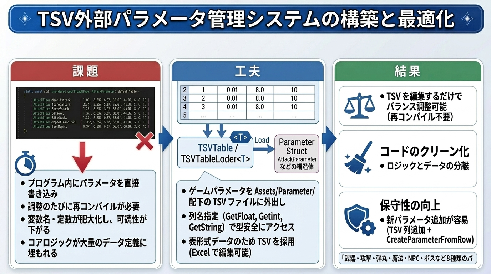
</a>

### 導入背景
当初は`std::unordred_map`を用いてテーブル管理を行っていました。
しかし、開発が進むうちに調整項目や引数が増えテーブルとしての視認性が悪くなってしまう問題が発生してしまいました。そこで、この問題を解決するべくTSVファイルによるパラメーターの外部化を図りました。これによりTSVデータの数値を変更するだけでゲームへ反映することができ、誰でも簡単に調整が可能となっています。

### なぜJSONではなくTSVなのか
ステータス管理としてJSONを用いれる例は多いと思います。ですが、今回の担当範囲は武器種や弾丸などの数値一覧となりいわゆる表データであります。1行1列ごとに調整項目という構造上である以上、TSVファイルが最適だと判断しました。また、TSVファイルはExcelデータをそのまま編集できるためプログラムが慣れていない方でも編集が容易なのは大きなメリットだと感じています。JSONの場合、括弧やカンマの記載ミスなどにより表形式のデータを手作業で直す用途には向きにくいと考えました。以上の理由から、汎用性の高い JSON ではなく、今回のデータ構造と編集フローに合った TSV を採用しました。

---

##　7.オブジェクトプールによる生成/破棄コストの削減

<a href="Image/ObjectPool.png" target="_blank">
  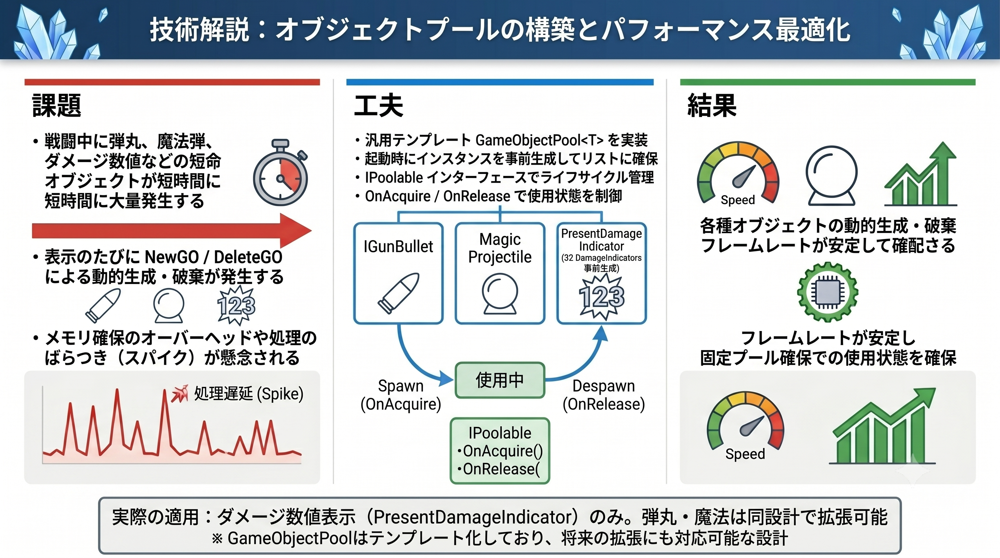
</a>

### 処理の流れ

起動時にテンプレートから必要数を把握し、事前に生成しています。
また、表示のタイミングを`Active()`,`OnRelease()`で切り替え、
プールにからの状態ができた場合のみ、`Factory`クラスから追加生成を依頼しています。

### 他システムとの組み合わせ
攻撃Stateは発射タイミング、`BulletFireRequest` / `BulletFactory` は生成ロジック、`Template<>` は取得・返却を担当します。
生成と再利用を分離することで、セクション4のFactory設計と役割が重ならない構成にしています。
まず `PresentDamageIndicator` から適用し、弾丸・魔法も同じ流れで載せられるようにしています。

### この構成になった理由

Factoryパターンのみだと毎フレーム生成を行わなければならなく、生成と破棄に負荷がとてもかかってしまいます。また、プールだけの適応としても種類ごとの生成にはプール側に偏ってしますため少し普通号に感じてしましした。そこで、両者を組み合わせることで生成時のルールと寿命を管理するだけでよくなり、他のプール化したい対象が居れば同様の手法で取り組めるようになっています。

---

## 8. 非同期ロードと段階的構築システム

<a href="Image/Loading.png" target="_blank">
  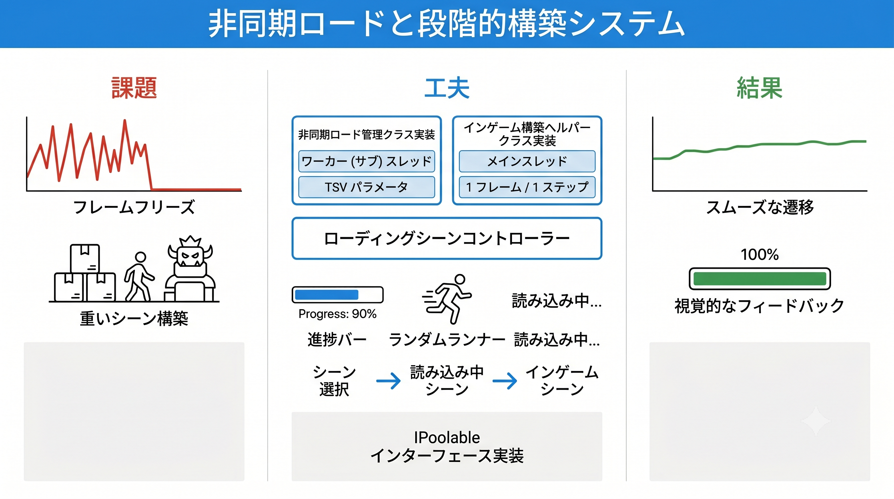
</a>

### 処理の流れ

1. シーン選択
2. ローディングシーンへ遷移
3. サブスレッド：TSV等の読み込み
4. メインスレッド：1フレーム1ステップでインゲーム構築
5. 完了後、インゲームシーンへ遷移

読み込み中は進捗バーに加え、武器種ごとのランナー演出を表示します。
以下は `Video` フォルダ内の4種類の差分動画です。

  

    

      剣
    

    

      <video src="Video/Loading_Sword.mp4" controls muted loop playsinline></video>
    

    
剣キャラのローディング演出

  

  

    

      ハンマー
    

    

      <video src="Video/Loading_Hammer.mp4" controls muted loop playsinline></video>
    

    
ハンマーキャラのローディング演出

  

  

    

      杖
    

    

      <video src="Video/Loading_Wand.mp4" controls muted loop playsinline></video>
    

    
杖キャラのローディング演出

  

  

    

      銃
    

    

      <video src="Video/Loading_Gun.mp4" controls muted loop playsinline></video>
    

    
銃キャラのローディング演出

  

### 他システムとの組み合わせ

`LoadStageData` でステージ構成を定義し、TSVでパラメータを外部化しています。
非同期ロード管理がファイル読み込み・パース、段階構築ヘルパーがメインスレッド上でのオブジェクト生成、ローディングシーンが遷移制御と演出を担当します。
「何を載せるか」「読む」「載せる」「見せる」を分け、セクション5・6のデータ駆動設計の延長として構築しています。

### この構成になった理由

ファイルI/Oはサブスレッド向きですが、描画やゲームオブジェクトの生成はメインスレッド側の処理が多いため、全部を非同期に寄せず「読む／載せる」で分担しています。
4武器のランナー演出で、待ち時間中も処理が進んでいることを視覚的に伝えています。

### 今後の改善

現状は読み込みと構築の分担までですが、生成・読み込み対象をさらにスレッドで仕分けし、ロード時間の短縮を進めます。

---

## 提出・確認情報

| 項目 | 内容 |
|---|---|
| 起動方法 | `Game.exe` を起動してください |
| 推奨環境 | Windows 11 |
| 推奨操作 | Xbox系コントローラー (DirectInputSystemが採用されているため)|
| キーボード操作 | 対応 |
| 確認してほしい内容 | PV / キャラクター紹介 / 攻撃方法 / 入力Adapter / BulletFireRequest |
| 既知の不具合 | 提出時点で把握している進行不能の既知不具合はありません |

---

## 今後の改善予定

- リファクタリング
  - 階層型StateにIteratorパターンを導入し、攻撃派生の管理をさらに整理する予定です。

- ステージ追加
  - ステージを2〜3種類追加し、バリエーションを増やす予定です。

- 非同期ロード
  - ステージを読み込む際など、間のウェイト処理として実装していこうと思います。

- ガードシステムの実装
  - ガードを展開するとダメージを一定期間軽減できるように実装予定です。

- 生成データのスレッド分け
  - 現在はメインスレッドに生成を任せている状態なので、メインスレッドとサブスレッドに何を読み込ませるかを仕分けし、ローディング画面の最適化を行おうと思います。  　

---

## リンク

| 種類 | URL |
|---|---|
| YouTube | [こちらからアクセスできます](https://www.youtube.com/@%E5%B1%B1%E5%8F%A3%E9%9A%BC-kawahara) |
| Googleドライブ | [こちらからアクセスできます](https://drive.google.com/drive/folders/1uRL0AiCKYP2HvznbBXS_wLJY3bZnr4bU?usp=drive_link) |
| GitHub | [こちらからアクセスできます](https://github.com/TanimotoYuuki/Project-EH) |
| 過去作品（個人制作） | [こちらからアクセスできます](https://github.com/YamaguchiHayato/Dimensional-Flip) |
|過去作品(ポートフォリオ)|[こちらからアクセスできます](https://yamaguchihayato.github.io/DimensionFlip-Portfolio.github.io/)|